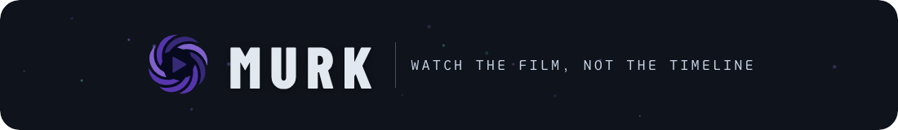
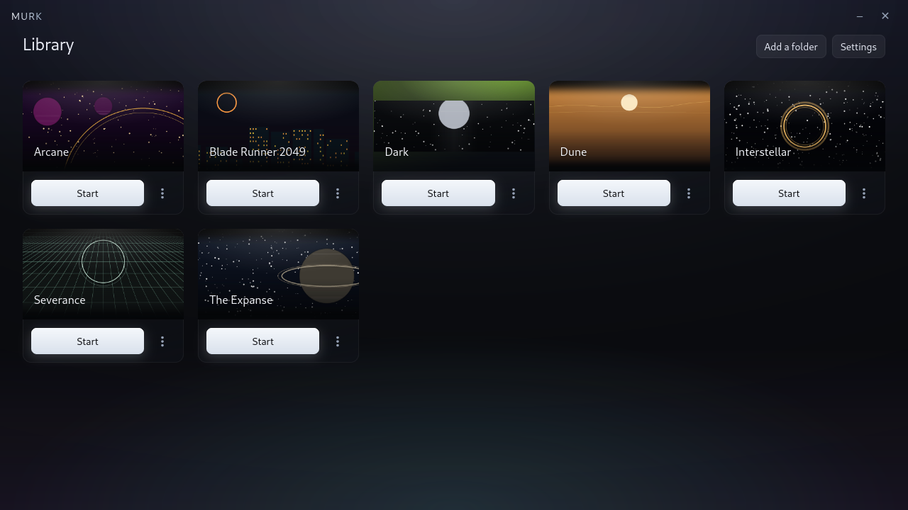
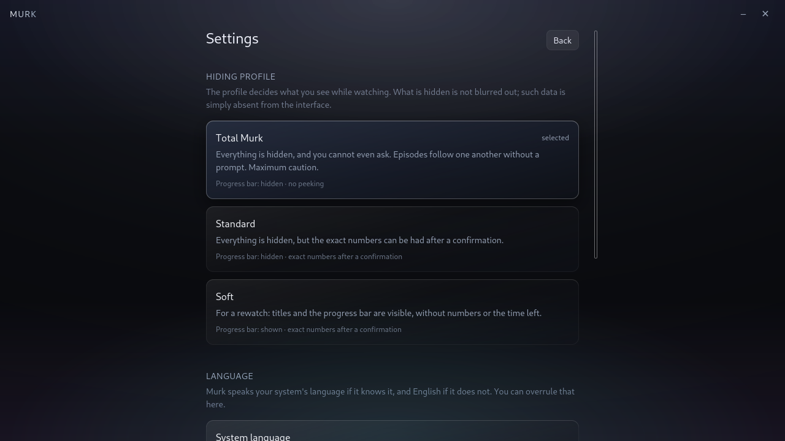
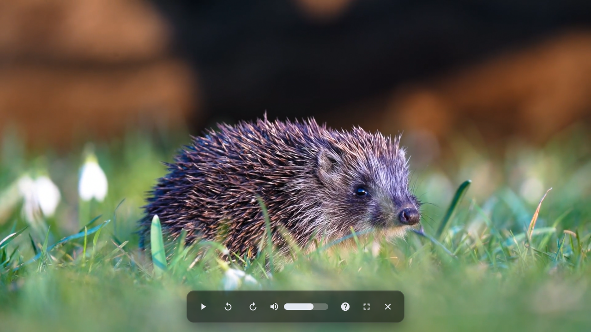
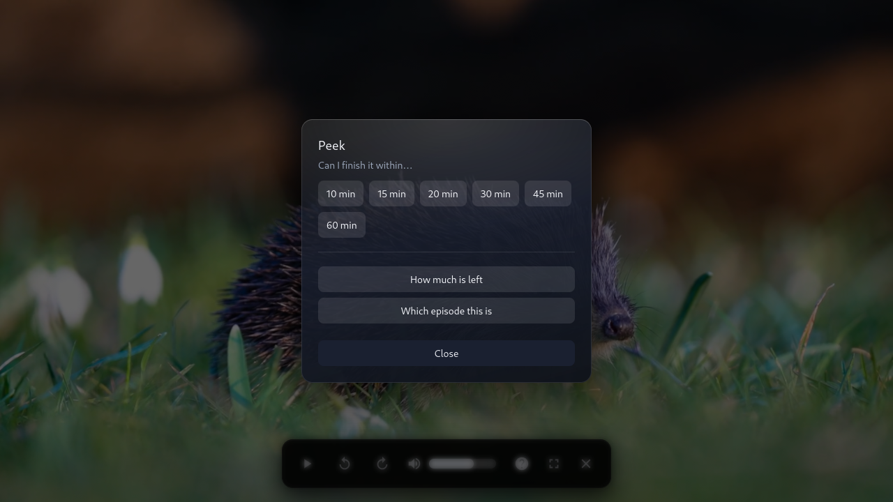

<div align="center">



**Смотрите сериал, а не таймлайн.**

<a href="https://github.com/3Lord3/Murk/actions"></a>
<a href="#%D1%83%D1%81%D1%82%D0%B0%D0%BD%D0%BE%D0%B2%D0%BA%D0%B0"></a>
<a href="#%D0%BB%D0%B8%D1%86%D0%B5%D0%BD%D0%B7%D0%B8%D1%8F"></a>
<a href="https://tauri.app"></a>
<a href="https://www.rust-lang.org"></a>

[English](README.md) · [Русский](README.ru.md)

</div>

### Ваш сериал, без спойлеров

Murk, это настольный плеер для сериалов и фильмов, который отказывается их спойлерить.

Обычные плееры рассказывают сюжет раньше самой сцены. Полоса просмотра
показывает, что до развязки три минуты, заголовок окна называет серию, счётчик
«9/24» сообщает, что сезон только начался. Murk по умолчанию не показывает
ничего из этого. Не замазывает и не прячет за переключателем: этих чисел просто
нет на экране.

<div align="center">

| | |
|---|---|
|  |  |
|  |  |

</div>

# Возможности

- 🙈 **Без спойлеров.** Ни названия, номера серии и сезона, ни количества
  серий, ни полосы просмотра, ни позиции, длительности и остатка. Скрытое
  остаётся в бэкенде, поэтому его не покажет ни ошибка вёрстки, ни открытые
  devtools, ни случайная строка в логе.
- 👀 **Успею ли досмотреть.** Узнайте успеете ли вы досмотреть фильм или серию за 10-60 минут, не спойлеря точное оставшееся время и текущий момент просмотра.
- 📚 **Тихая библиотека.** Сериал добавляется папкой, а не файлом, потому что
  имя файла само по себе бывает спойлером. У карточки одна кнопка, *Начать* или
  *Продолжить*. Никаких списков серий, подсказок и индикаторов.
- ▶️ **Финал остаётся закрытым.** Следующая серия сразу запускается или появляется окошко об окончании серии — зависит от выбранного профиля
- 🎬 **Обложки, которые ничего не выдают.** Никакого скачанного арта. Обложка,
  это ваш собственный файл или ровное цветовое поле, подобранное по названию
  сериала.
- 🗣️ **Мультиязычность.** Следует языку системы, переопределяется в
  настройках.

## Профили

Профиль решает, поле за полем, что бэкенду разрешено отдать в окно.
Переключается в настройках в любой момент.

| На экране | Полный мрак | Стандарт | Мягкий |
|---|:--:|:--:|:--:|
| Название, сезон и номер серии | скрыто | скрыто | видно |
| Сколько серий в сезоне | скрыто | скрыто | скрыто |
| Полоса просмотра | скрыто | скрыто | видно |
| Позиция, длительность, остаток | скрыто | скрыто | скрыто |
| Метки глав | скрыто | скрыто | скрыто |
| Обложка из вашей папки | скрыто | скрыто | видно |
| Что будет дальше | скрыто | скрыто | скрыто |
| Конец серии | ничего: следующая просто начинается | карточка с обратным отсчётом | карточка с обратным отсчётом |
| «Успею за N минут?» | нельзя спросить | «да» или «нет», шагами по 5 минут | «да» или «нет», шагами по 5 минут |
| Точный остаток, серия и сезон | нельзя спросить | после подтверждения | после подтверждения |

# Перевод

Интерфейс поставляется на **русском** и **английском** языках, следует языку
системы и переопределяется в настройках. Переводы лежат прямо в репозитории,
это обычные JSON-каталоги, исходный из них `src/locales/en.json`. Чтобы добавить язык
или исправить перевод, откройте pull request с изменениями каталогов; см.
[CONTRIBUTING.md](CONTRIBUTING.md#translations).

# Установка

Murk нацелен на Linux и находится в статусе пре-релиза (v0.1.0). В репозитории
дистрибутивов его пока нет, так что получить его можно сборкой из исходников,
это три команды:

```sh
./scripts/deps.sh --install   # системные библиотеки; --check только покажет их
pnpm install
pnpm tauri build              # либо `pnpm tauri dev`, чтобы сразу запустить
```

Самой сборке нужны pnpm, Node 22 и стабильный Rust. Всё остальное это
системные библиотеки, и `deps.sh` знает их названия для Debian, Ubuntu, Fedora
и Arch.

libmpv нужен **client API 2.x** (`libmpv.so.2`, mpv ≥ 0.36); если версия
старее, сборка остановится именно с этой фразой, а не со стеной ошибок
компоновщика. Дистрибутивы, где всё ещё `libmpv.so.1`, прежде всего
Ubuntu 22.04 и Debian 12, обслуживаются Flatpak-сборкой.

## Пакеты

Готовые пакеты складываются в `src-tauri/target/release/bundle/`.

| Канал | Дистрибутивы | Чем собрать | Статус |
|---|---|---|---|
| `.deb` | Debian, Ubuntu | `pnpm tauri build --bundles deb` | работает; собирается и проверяется в CI |
| `.rpm` | Fedora | `pnpm tauri build --bundles rpm` | работает; зависимости по soname |
| AppImage | все | `./scripts/appimage.sh` | работает; несёт в себе mpv и WebKitGTK |
| Flatpak | все | [`packaging/flatpak/`](packaging/flatpak/README.md) | работает; воспроизведение в песочнице проверено |

AppImage собирайте скриптом, а не через `tauri build --bundles appimage`:
хук AppRun от Tauri принудительно выставляет `GDK_BACKEND=x11`, что затащило бы
видеоплеер в XWayland в любой Wayland-сессии. Скрипт это отменяет и
переупаковывает образ.

Зависимости пакетов прописаны вручную: сборщик Tauri не запускает ни
`dpkg-shlibdeps`, ни ELF-сканер rpm и иначе выпустил бы пакет, который ставится
без ошибок, а потом не стартует. В CI за этим следит
`scripts/check-package-deps.sh`, а рассуждение целиком лежит в
[src-tauri/PACKAGING.md](src-tauri/PACKAGING.md).

# Разработка

- [CONTRIBUTING.md](CONTRIBUTING.md): правила, и главное из них, *ничто, что
  может испортить сюжет, не пересекает границу.*
- [docs/DEVELOPMENT.md](docs/DEVELOPMENT.md): архитектура, сборка, тесты.

# Лицензия

Murk — свободное программное обеспечение под лицензией **GPL-2.0-or-later**:
GNU General Public License версии 2 либо, по вашему выбору, любой более поздней
версии. Полный текст — в файле [LICENSE](LICENSE).